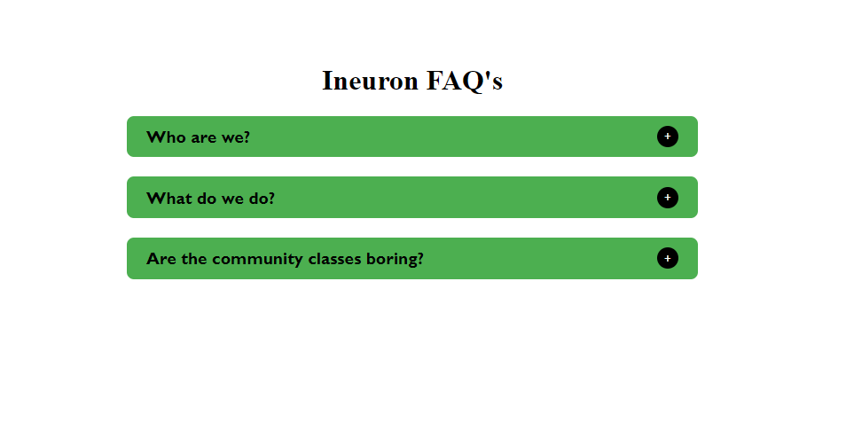
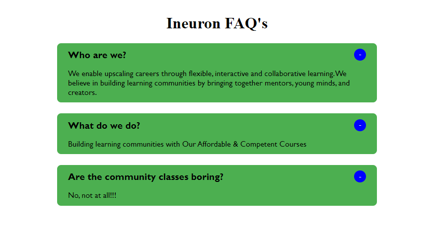

# Accordian

This is robost method to create faqs in the system by using pure Javascript.

# Technologies Use

- HTML
- CSS
- Javascript

## What is outcome of this project ?

- create element by using Javascript, append a element into container, which can be used multiple times
- explore repetative eventlistner

### Time taken to complete this project is 6 hours

&nbsp;

### faq close image

&nbsp;

### faq-open image

